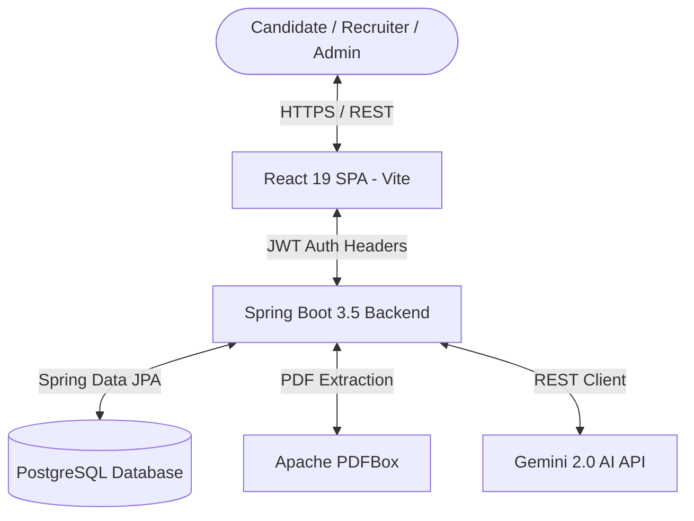
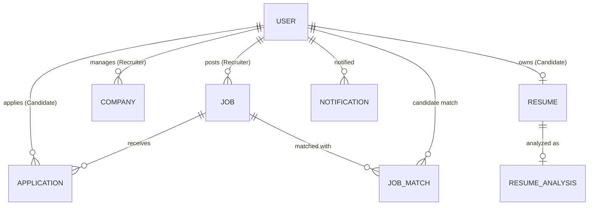

# HireSphere.ai

An intelligent, full-stack AI-powered recruitment platform designed to streamline hiring workflows for candidates, recruiters, and administrators through automated PDF resume analysis, candidate-job compatibility matching, ranked AI job recommendations, and an interactive AI Recruiter Assistant.

---

## 1. Project Overview

HireSphere.ai solves inefficiency and manual friction in traditional talent acquisition by integrating domain-specific AI analysis into a modern multi-tenant recruitment workflow.

### User Workflows:
- **Candidates**: Manage profiles, upload PDF resumes, receive automated AI Resume Analysis reports, view candidate-job compatibility scores, receive personalized AI-ranked job recommendations, and submit applications.
- **Recruiters**: Manage company profiles, post and moderate active jobs, review applicant submissions with candidate resume details, track application state changes, and utilize an interactive **AI Recruiter Assistant** to query and rank applicants.
- **Administrators**: Moderate system users (block/unblock), inspect active companies, manage jobs and applications, filter records across roles, and analyze platform-wide recruitment metrics.

---

## 2. Key Features

### Candidate Features
- **Authentication**: JWT-secured registration and login.
- **Profile Management**: Maintain professional summaries, skills, education, college, graduation year, experience, GitHub, and LinkedIn links.
- **Resume Management**: Secure PDF upload, download, and single-click removal.
- **AI Resume Analysis**: Automated PDF text extraction and structured resume profiling.
- **Job Browsing**: Filter open positions by title, keyword, location, and job type (`FULL_TIME`, `PART_TIME`, `CONTRACT`, `REMOTE`, `HYBRID`).
- **AI Job Matching**: Analyze real-time compatibility score (0-100%) against specific job postings.
- **AI Job Recommendations**: View top-ranked active jobs personalized to candidate resume profiles.
- **Application Tracking**: Submit applications with cover letters and track live recruitment stage updates (`APPLIED`, `SHORTLISTED`, `INTERVIEW`, `HIRED`, `REJECTED`).
- **Notifications**: Live notification bell with unread count badges for application stage updates.

### Recruiter Features
- **Recruiter Authentication**: Role-restricted JWT access (`ROLE_RECRUITER`).
- **Company Profile**: Create and manage verified company details (industry, website, description, location).
- **Job Management**: Create, view, edit, and close job postings.
- **Applicant Review**: Access submitted candidate profiles, cover letters, and uploaded PDF resumes.
- **Application Status Management**: Update recruitment stages (`SHORTLISTED`, `INTERVIEW`, `HIRED`, `REJECTED`) with automatic candidate notifications.
- **AI Recruiter Assistant**: Query applicant datasets in natural language (e.g., *"Find the best 5 candidates"*, *"Who is missing React?"*).

### Admin Features
- **Admin Dashboard**: System-wide platform metrics and entity statistics.
- **User Moderation**: Filter, search, and block/unblock users (`ACTIVE` / `BLOCKED`).
- **Entity Management**: Comprehensive oversight over companies, job listings, and application submissions.
- **Role-Based Authorization**: Restrict system actions via Spring Security `@PreAuthorize`.

---

## 3. AI Modules Architecture

### 1. AI Resume Analysis
```
Candidate PDF Resume ──> Apache PDFBox ──> Gemini 2.0 AI ──> Structured Resume Analysis ──> PostgreSQL (resume_analyses)
```
Extracts readable text from uploaded PDF resumes and uses Gemini 2.0 to extract candidate summaries, technical skills, programming languages, frameworks, databases, tools, years of experience, key strengths, and improvement areas.

### 2. AI Job Matching
```
Candidate Resume Analysis + Job Requirements ──> Gemini 2.0 AI ──> JobMatch Entity (0-100% Score) ──> PostgreSQL (job_matches)
```
Compares candidate resume profiles with job qualifications to output normalized match percentages (0-100%), matched skills, missing skills, experience alignment, education alignment, and overall match recommendations (`Strong Match`, `Moderate Match`, `Weak Match`).

### 3. AI Job Recommendations
```
Active PostgreSQL Jobs ──> Stage 1 Application Filtering ──> Stage 2 Gemini AI Ranking ──> Ranked Candidate Recommendations UI
```
Evaluates candidate profiles against active jobs while excluding positions where the candidate was already hired. Returns AI-ranked job recommendations on the candidate dashboard.

### 4. AI Recruiter Assistant
```
Recruiter Authorized Job ──> Verify Ownership (Server-side) ──> Aggregate Applicants + Match Data ──> Gemini 2.0 AI ──> Recruiter Query Answer & Candidate Rankings
```
Allows recruiters to ask natural language questions about applicants for their specific jobs. Server-side checks enforce that recruiters cannot access applicants belonging to jobs posted by other recruiters.

---

## 4. Technology Stack

| Layer | Technology |
| :--- | :--- |
| **Frontend** | React 19, Vite 8, Vanilla CSS Design System |
| **Backend** | Java 21, Spring Boot 3.5.15, Spring Data JPA, Spring Security |
| **Database** | PostgreSQL 18, Hibernate ORM |
| **Authentication** | JWT (JSON Web Tokens), BCrypt Password Encoder |
| **AI Integration** | Gemini 2.0 Flash API REST Client |
| **PDF Extraction** | Apache PDFBox 3.0.4 |
| **API Documentation** | OpenAPI 3.0 / Swagger UI (Springdoc) |
| **Build Tools** | Apache Maven 3.x, npm |

---

## 5. System Architecture



---

## 6. Role-Based Access Control & Security

- **`ROLE_JOB_SEEKER`**: Candidate access only (profile, resume upload, job match, job recommendations, application submission).
- **`ROLE_RECRUITER`**: Recruiter access only (company creation, job posting, applicant view, recruitment status management, AI Recruiter Assistant).
- **`ROLE_ADMIN`**: Administrator oversight (user moderation, block/unblock, company/job/application administration).
- **Security Enforcement**:
  - Passwords are encrypted with BCrypt and annotated with `@JsonProperty(access = WRITE_ONLY)`.
  - Recruiter job ownership is validated server-side (`job.getPostedBy().getId().equals(recruiterId)`).
  - Cross-tenant candidate access is blocked with `HTTP 403 Forbidden`.

---

## 7. Database Entity Relationships



---

## 8. API Endpoint Reference

Swagger UI API documentation is accessible at `http://localhost:8080/swagger-ui.html`.

### Key Endpoints Overview

| Method | Endpoint | Authorized Role | Description |
| :--- | :--- | :--- | :--- |
| `POST` | `/api/auth/register` | Public | Register new candidate or recruiter account |
| `POST` | `/api/auth/login` | Public | Authenticate user and return JWT token |
| `GET` | `/api/users/profile` | Authenticated | Retrieve authenticated user profile |
| `PUT` | `/api/users/profile` | Authenticated | Update user profile details |
| `POST` | `/api/resumes/upload` | Candidate | Upload PDF resume |
| `GET` | `/api/resumes/my` | Candidate | Download/retrieve candidate resume |
| `POST` | `/api/resumes/{id}/analyze` | Candidate | Trigger AI Resume Analysis |
| `GET` | `/api/jobs` | Public/Candidate | Browse active job listings |
| `POST` | `/api/jobs` | Recruiter | Post new job opening |
| `POST` | `/api/jobs/{id}/match` | Candidate | Generate AI Job Match score and report |
| `GET` | `/api/recommendations/jobs` | Candidate | Retrieve top AI-ranked job recommendations |
| `POST` | `/api/applications/job/{jobId}` | Candidate | Submit job application |
| `PUT` | `/api/applications/{id}/status` | Recruiter | Update applicant status (`SHORTLISTED`, `INTERVIEW`, etc.) |
| `POST` | `/api/recruiter/assistant` | Recruiter | Query AI Recruiter Assistant for job applicant insights |
| `GET` | `/api/admin/users` | Admin | Search and filter system users |
| `PUT` | `/api/admin/users/{id}/status` | Admin | Block or unblock user account |

---

## 9. Repository Structure

```
HireSphere-AI/
├── backend/
│   ├── src/main/java/com/hirsphere/backend/
│   │   ├── config/          # SecurityConfig, DataInitializer
│   │   ├── controller/      # Auth, User, Job, Application, Resume, AI Controllers
│   │   ├── dto/             # Structured API Data Transfer Objects
│   │   ├── entity/          # JPA Entities (User, Job, Application, ResumeAnalysis, JobMatch, etc.)
│   │   ├── repository/      # Spring Data JPA Repositories
│   │   └── service/         # Business logic and AI service implementations
│   ├── src/main/resources/
│   │   └── application.properties
│   └── pom.xml
├── frontend/
│   ├── src/
│   │   ├── components/      # Modular UI components (RecruiterAssistant, etc.)
│   │   ├── App.jsx          # Main application router and state manager
│   │   └── App.css          # Design system & HSL theme styling
│   ├── package.json
│   └── vite.config.js
├── .gitignore
└── README.md
```

---

## 10. Local Setup Instructions

### Prerequisites
- **Java Development Kit (JDK)**: Version 21 or higher
- **Node.js**: Version 18 or higher
- **PostgreSQL**: Version 15+ running on port `5432` with a database named `hirsphere_db`

### 1. Database Configuration
Ensure PostgreSQL is running locally and create the database:
```sql
CREATE DATABASE hirsphere_db;
```

### 2. Backend Setup
Navigate to the `backend` directory:
```bash
cd backend
```
Set the optional Gemini API key environment variable (if omitted, heuristic fallbacks will operate smoothly):
```bash
# Windows PowerShell
$env:GEMINI_API_KEY="your_gemini_api_key_here"
```
Run the Spring Boot application using the wrapper:
```bash
# Windows
.\mvnw.cmd spring-boot:run

# Linux/macOS
./mvnw spring-boot:run
```
The backend server will start on `http://localhost:8080`.

### 3. Frontend Setup
Navigate to the `frontend` directory in a new terminal window:
```bash
cd frontend
```
Install dependencies and launch the Vite development server:
```bash
npm install
npm run dev
```
---

## 11. Deployment Preparation & Environment Configuration

HireSphere.ai is pre-configured for cloud deployment on platforms like Render, AWS, Heroku, or Railway.

### Environment Variable Specification

| Variable | Description | Default Value / Local Fallback |
| :--- | :--- | :--- |
| `DB_URL` | PostgreSQL JDBC connection URL | `jdbc:postgresql://localhost:5432/hiresphere` |
| `DB_USERNAME` | PostgreSQL database username | `postgres` |
| `DB_PASSWORD` | PostgreSQL database password | `raghu123` |
| `PORT` | Spring Boot web server HTTP port | `8080` |
| `JWT_SECRET` | Secret key for signing authentication tokens | Defaults to fallback dev key |
| `GEMINI_API_KEY` | Google Gemini AI 2.0 Flash API key | Optional (triggers heuristic fallback if unset) |
| `CORS_ALLOWED_ORIGINS` | Comma-separated list of allowed frontend origins | `http://localhost:5173,http://localhost:3000` |
| `UPLOAD_DIR` | Directory path for storing uploaded PDF resumes | `./uploads/resumes` |
| `VITE_API_URL` | Frontend API base URL | `http://localhost:8080/api` |

### Deployment Architecture Considerations
- **Frontend (Vite / React 19)**: Build production bundle using `npm run build` (`dist/` folder) and host on Vercel, Netlify, or AWS S3/CloudFront. Configure `VITE_API_URL` pointing to the backend.
- **Backend (Spring Boot 3.5)**: Package executable JAR via `./mvnw clean package` and deploy to containerized hosts (Render, AWS ECS, Heroku). Configure `CORS_ALLOWED_ORIGINS` with the production frontend domain.
- **PostgreSQL Database**: Managed PostgreSQL instance (Supabase, AWS RDS, Neon). Ensure `DB_URL`, `DB_USERNAME`, and `DB_PASSWORD` are set in production environment variables.
- **File Storage**: Resumes are stored on the local persistent disk path specified by `UPLOAD_DIR`. For multi-instance horizontal scaling, attach a persistent block volume or configure object storage.

---

## 12. Verification & Testing

- **Backend Compilation**: Clean compilation verified via Maven wrapper (`mvnw test-compile`).
- **Frontend Build**: Verified production build using Vite (`npm run build`).
- **Security Testing**: Server-side role protection (`HTTP 401` for unauthenticated, `HTTP 403` for invalid role access) verified across candidate and recruiter endpoints.
- **End-to-End Workflows**: Verified Candidate flow (resume upload, AI analysis, matching, application), Recruiter flow (company creation, job posting, status management, AI Assistant), and Admin moderation flow.

---

## 12. Screenshots Placeholder

- **Candidate Dashboard & AI Recommendations**: `docs/screenshots/candidate_dashboard.png`
- **AI Resume Analysis Report**: `docs/screenshots/resume_analysis.png`
- **AI Job Matching**: `docs/screenshots/job_match.png`
- **Recruiter Dashboard**: `docs/screenshots/recruiter_dashboard.png`
- **AI Recruiter Assistant**: `docs/screenshots/recruiter_assistant.png`
- **Admin Management Panel**: `docs/screenshots/admin_panel.png`

---

## 13. Future Enhancements

- Production cloud deployment configurations (Docker containerization & Kubernetes manifests).
- Automated email/SMS interview invitation dispatches.
- Multi-format resume support (Microsoft Word `.docx`).
- Recruiter analytics export (CSV/PDF candidate reporting).

---

## 14. Author & License

Developed for **HireSphere.ai**. Distributed under standard software project terms.
